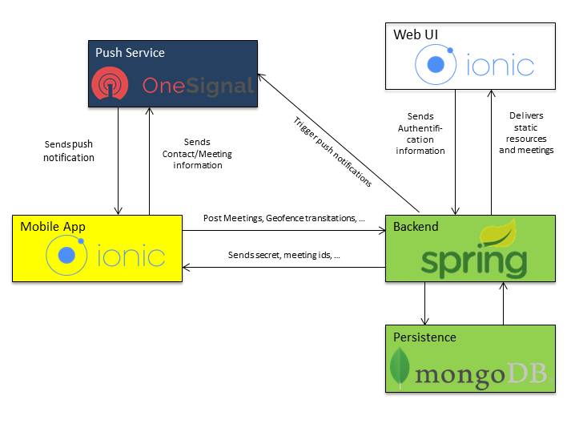

# MeetNow

MeetNow is a mobile application project in context of the lecture Platforms & Frameworks for Students of Business 
Information Technology at the [DHBW Mannheim](https://www.dhbw-mannheim.de/).

To get a quick overview, check out our 
[HTML5 Presentation](http://htmlpreview.github.io/?https://github.com/XLexxaX/MeetNow/blob/master/presentation/presentation.html)!

## _Table of contents_
- [Use Case](#use-case)
- [Architectural Overview](#architectural-overview)
- [Browser App](#browser-app)
- [URL's to our individual mobile App repositories (5th Semester)](#link-to-our-individual-github-repositories)
- [Frontend](./mobileApp/README.md)
    + [Contacts](./mobileApp/README.md#contacts)
    + [Plan a meeting](./mobileApp/README.md#plan-a-meeting)
    + [Retrieve a meeting over OneSignal](./mobileApp/README.md#retrive-a-meeting-over-OneSignal)
    + [Deciding if a meeting should start](./mobileApp/README.md#deciding-if-a-meeting-should-start)
    + [Share a meeting](./mobileApp/README.md#share-a-meeting)
    + [Additional Pages not shown in the videos](./mobileApp/README.md#additional-pages-not-shown-in-the-videos)
- [Backend](./backend/README.md)
    + [Setup Development Environment](./backend/README.md#setup-development-environment)
    + [Swagger Usage](./backend/README.md#swagger-usage)
    + [API Endpoints with Spring](./backend/README.md#api-endpoints-with-spring)
    + [Persistence Handling](./backend/README.md#persistencehandling)
    + [Location Management](./backend/README.md#location-management)
    + [Consent Management](./backend/README.md#consent-management)
    + [Maven Usage and deployment](./backend/README.md#maven-usage-and-deployment)
    + [Security](./backend/README.md#security)

## Use Case

The app wants to organize meetings smartly. A user defines a meeting with somebody he wants to meet regularly. The app
takes care of the meeting to occur regularly. The whole process:

1. A user adds another using social sharing and an app of his choice.
2. The user plans the event setting up an area where the meeting should occur.
3. When all participants are in the defined area, the participants receive notifications that the meeting could start
and they have to submit whether they have time right now or not.
4. When all participants have time, the meeting takes place.

 (There are videos for each step in the 
[presentation](http://htmlpreview.github.io/?https://github.com/XLexxaX/MeetNow/blob/master/presentation/presentation.html)):

## Architectural Overview
Below is a picture of our architectural setup. 
The mobile App is developed with the Ionic Framework, version 2. It persists necessary data using the native ionic 
storage. Using the OneSignal plugin for ionic, the mobile App is able to send push notifications to other clients. 
The app also exchanges information with our backend via REST-Calls, e. g. about meetings or geofence transitions. 

The backend itself is written in Java, using the [Spring Boot Framework](https://projects.spring.io/spring-boot/). 
The persistence Layer for the Spring Application 
is [MongoDB](https://www.mongodb.com/), as this was the most sufficient way of storing the meeting and user information. 
The backend also hosts the browser version of our app by serving the static HTML/CSS/JS-Files for the desktop browsers 
and handling 
authentication. The application is hosted on [SAP Cloud Platform](https://cloudplatform.sap.com/index.html). Our 
backend also communicates with the [OneSignal REST API](https://documentation.onesignal.com/v3.0/reference) to trigger
push notifications to participants of a meeting.

## Browser App
As described above, our app also runs purely in the browser, but with strongly limited functionality. This is mainly
to show we are easily able to use the same code we are writing for the mobile App for the browser application.
You can only view your currently planned meetings. Adding contacts is not possible as this requires OneSignal and 
planning a meeting is also not possible because you can obviously not set geofences in a browser. 

If you'd like to preview our browser app, do it also follows:
1. Open this URL: https://meetnow.cfapps.eu10.hana.ondemand.com
2. Use the following credentials to login
    - Username: 6fd9fc3d-32ec-4002-962a-904c552551ff
    - Password: -4499704664976588778

**_Warning: If you delete a meeting in the browser, it will be deleted locally and on server! If you do so you will have
one less to explore._**

The credentials usually can be obtained in the mobileApp on the settings page (as shown [here](TODO)).

## Link to our individual Github repositories
Florian Bunsmann: https://github.com/flodesflo/MobileDev

Carmen Rannefeld: https://github.com/carmabell/MobileApp

Alexander Lütke:
