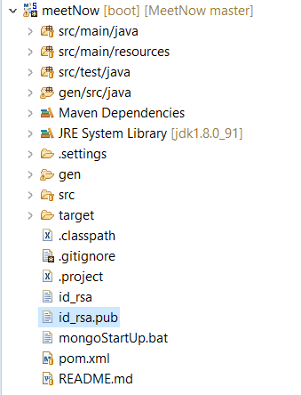

# Backend for the meetNow app
Written in Java using [Spring Boot](https://projects.spring.io/spring-boot) and [swagger](http://swagger.io/). 
Persistence is handled by [MongoDB](https://www.mongodb.com/).
More information:
1. [Security](./Security.md)
2. [Swagger usage](././src/main/resources/README.md)

## Setup Development Environment
### Maven
1. If you don't have maven, download the binary zip archive from [here](https://maven.apache.org/download.cgi).
2. Follow the installation steps described [here](https://maven.apache.org/install.html).
3. Especially ensure that `JAVA_HOME` environment variable is set and add the maven/bin directory to the `PATH` Variable.

### Eclipse / Spring Tool Suite Setup
1. Create a new general project at the location of the MeetNow/backend directory.
2. Press `F5`(refresh) on the project. The subfolders should now appear.
3. Right-click the project and choose `Configure` -> `Convert to Maven project`.
4. Press `Alt+F5` to update the maven project and download necessary dependencies.
5. Run `mvn clean verify` in a terminal in the project folder. This will generate the class files from the swagger code generation.
6. Add the `gen/src/java` directory to the build path (only the subfolder!). Therefore right-click the java folder and choose 
`Build-Path`->`Use as source folder`.

Your project structure should look as shown below now.



### MongoDB
The java application uses MongoDB for persistence. In order to be able to test your application locally, follow the described steps.
1. Download MongoDB from [here](https://www.mongodb.com/download-center#community).
2. Follow the installation guide using the default options.
3. Create the directory where mongoDB will store data. Open a terminal and enter `md C:\data\db` as described [here](https://docs.mongodb.com/manual/tutorial/install-mongodb-on-windows/#run-mongodb-community-edition).
4. Test if everything works by starting your MongoDB. Therefore go into the installation directory, e. g. `cd "C:\Program Files\MongoDB\Server\3.4\bin"`
and run `mongod`. End the process with `Ctrl+C` afterwards.
5. For convenience while testing, you can also create a `.bat` file in your project. Therefore right-click your Eclipse/STS project and choose `New`->`Other` and  `File`. Enter the filename `mongoStartUp.bat`. Open the file with a text editor by right-clicking it and choosing `Open-With`->`Text Editor`.
Enter the following line and save the file (the specified path has to match your installation directory).
```
"C:\Program Files\MongoDB\Server\3.4\bin\mongod.exe"
```
If you want to run the bat file now, you right-click and choose `Open-With`->`System Editor`. After you've done this once, you can just double-click the file to start MongoDB.

### Postman
1. Add the Postman Extension as a Chrome Plugin.
2. Open the Postman plugin by pressing the `windows key` and typing "postman". Choose the option `take me directly to the app`.

## Local Testing
Before you can test your spring application, you have to start MongoDB as described [above](#mongodb). So you need to run your mongoStartUp.bat file. You don't need to restart MongoDB every time you restart your application, so you can just leave it open in the background.
Test your spring Application:
- Eclipse: Open the `BackendApplication` class and choose `Run`->`Run-As`->`Java Application`.
- STS: Open the Spring Boot View and press the start button.

After Startup, you can access the application via postman. You can import example requests as a collection by choosing `Import` and navigating to your project directory and choosing the `MeetingApi.postman_collection.json` file. This will probably updated regularly, so you might have to delete the collection and import it again.

## Committing
1. Before you commit your changes to the github repository, always run a `mvn clean verify`. Only push to git if your build ended up with
`BUILD SUCCESS`. (Only for the spring project! If you changed something regarding the mobile app, you don't need to run maven)
2. Add your changes using your IDE or `git add filename`.
3. Commit your local changes using your IDE or `git commit -m "your commit message"`.
4. Fetch updates from upstream using your IDE or `git fetch`.
5. If there are updates, use `git rebase` to set your commit(s) on top of the remote commits.
6. After a successful rebase, push your changes to the remote repository using `git push`.

