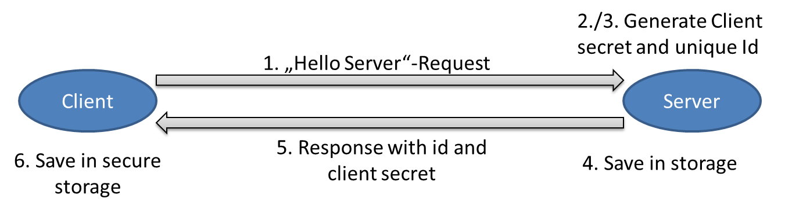

#Security
As our app processes confidential and personal data, we need to lay a strong focus on application security. This page discusses all the relevant aspects we need to keep in mind.

## Securing the requests against attackers
To make sure, nobody is able to extract private data from the requests going over the internet, all network connection should be secured, preferably with `https`. As we don't know by now if there will be the possibility to request a dedicated certificate for our VM, it would be best if we can use a self-singed certificate. On installation, this self-signed certificate would need to be accepted by the mobile device. 

TODO:
- verify this is possible
- Discuss different solution approaches

## Making server and client known to each other
### 1. Problem: Server does not know who the client is.
Initially, the server doesn't know the client at all. This is a potential security risk, as somebody else could send requests as 
this client. Possible solutions as shown below.

#### 1. Solution approach: Do it on our own.
When the client starts the app for the first time, he sends a "Hello-Server"-Request.
1. Client sends "Hello-Server"-Request.
2. The server generates a new unique client id.
3. The server generates a new random(!) client secret.
4. The server saves both information to the database.
5. The server responds to the client with the id and the client secret.
6. The client stores the id and the client secret best case in secure storage.

In every following request, the client sends his unique id and his client secret as additional information. The server checks the information is correct and processes the request.

+ Overall very easy but safe authentication handling
- Not sure how we could handle multiple devices.. as we somewhere need to store the secret. Might be an issue if we have to build a standalone web-application with limited functionality.

#### 2. Solution approach: Use third party authentication solution like OAuth2.
When the client starts the app for the firsst time, he sends a "Hello-Server"-Request.
1. Client accesses his OAuth2 provider and gets his web security token or whatever.
2. Client sends "Hello-Server"-Request with his token.
3. Server validates client information with OAuth2 provider and generates unique client id or uses some of the authentification information?.
4. Server saves necessary client information.
5. Server responds with the unique client id/ or just with OK.

In every following request, the server sends his web security token and his unique identifier as additional information. The server validates the information and afterwards processes the request.

+ This could be a solution if the app is used on different devices/on a standalone web client.
+ Probably more secure the 1. as widely used.
- We need to setup OAuth2/any other authentication process on client and server side... not fun at all, urgh..
 
### 2. Problem: Client does not know who the server is
This is solved if we can use the certificate based approach. Otherwise we need to discuss this again.