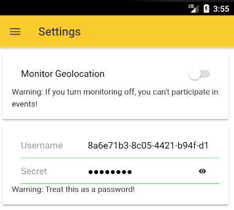
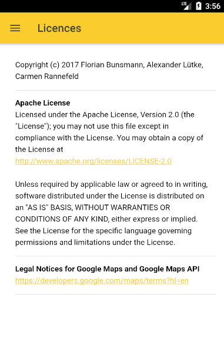

# Mobile MeetNow App
Build with Ionic2. The functionality/pages described in this readme can be observed in our presentation. This page will
give some more information about the technical side and will give hints where to find important code. Most of the plugins are initialized in the [app.component.ts](./src/app/app.component.ts), so you might want to take a look at that.

## _Table of contents_
+ [Contacts](#contacts)
+ [Plan a meeting](#plan-a-meeting)
+ [Retrieve a meeting over OneSignal](#retrive-a-meeting-over-OneSignal)
+ [Deciding if a meeting should start](#deciding-if-a-meeting-should-start)
+ [Share a meeting](#share-a-meeting)
+ [Additional Pages not shown in the videos](#additional-pages-not-shown-in-the-videos)
  - [Settings](#settings)
  - [Licences](#licences)

## Contacts
This functionality is for adding new contacts to organize meetings with. Find the code
in this [folder](./src/pages/contacts). A user sends a message with his unique user id to somebody else who also has the
MeetNow App installed. The message contains a link, which will automatically open in the MeetNow app and guide him to 
the contact page. He will have to add a display name to this contact. Afterwards, a post notification will be triggered
to the user who has sent out the friend request containing his own unique id. Again a display name has to be specified 
and now the users are connected with each other and can organize meetings with each other.

Used Plugins:
- [Cordova universal links plugin](https://github.com/nordnet/cordova-universal-links-plugin)
- [Ionic oneSignal plugin](https://documentation.onesignal.com/v3.0/docs/ionic-sdk-setup)
- [Ionic Social Sharing](https://ionicframework.com/docs/native/social-sharing)

## Plan a meeting
As shown in the video, plan a meeting is a three-stage process. 

First, the user enters a meeting title, chooses the type
of the meeting and crucially has to set a location. We use the cordova google maps plugin to do this and retrieve the
latitude and longitude values from the plugin for setting the geofences later on. The user can also change the radius of
the area, in which the meeting should take place.

On the second app page, the user can select the duration of the meeting and set the occurrence (daily, weekly or monthly).

On the third app page, the user selects the participants of the meeting, which he added before planning the event. Hitting 
the save button, a bunch of actions are triggered. The mobile App sends a request to the backend containing all the 
meeting information. Also, the meetings get's save in the local storage of the mobile device. The geofence plugin sets
up a new Geofence for the newly planned meeting to monitor. The participants are contacted directly using the ionic 
oneSignal plugin. Finally, navigation is triggered back to the overview page and all meetings are displayed on the 
overview list.

Here are the links to respective folders containg the code:
- [FirstPage](./src/pages/plan-event)
- [SecondPage](./src/pages/plan-event2) 
- [ThirdPage](./src/pages/plan-event3)

Used Plugins:
- [Ionic oneSignal plugin](https://documentation.onesignal.com/v3.0/docs/ionic-sdk-setup)
- [Cordova GoogleMaps plugin](https://github.com/mapsplugin/cordova-plugin-googlemaps)
- [Background-Geolocation plugin](https://github.com/transistorsoft/cordova-background-geolocation-lt)

## Retrieve a meeting over OneSignal
@Alex please write a few sentences about how this works. (client side)

## Deciding if a meeting should start
@Alex please write a few sentences about how this works (client side), especially 
posting the decision, retrieving the post notification meetings starts, setting up the meeting in the calender, ...

## Share a meeting
When the user is in the detail view for a meeting, he can also share the meeting information with his friends using the
share button, as shown in one of the videos. Code is available [here](./src/pages/viewScheduledEvent)

Used Plugins:
- [Ionic Social Sharing](https://ionicframework.com/docs/native/social-sharing)

## Additional Pages not shown in the videos

### Settings
On the settings page, there is the functionality to disable tracking of geofences. This might be useful is a user is 
busy at the moment and can't participate anyway in meetings or if he doesn't want to participate at the moment.
On the settings page, the user can obtain the login information for the desktop browser. Therefore he needs his unique
id and his private secret, which he can view by clicking the eye icon in the password field.

### License Page
Not much to talk about, just some static content which contains the License information regarding the app and from the
Google Maps API.

